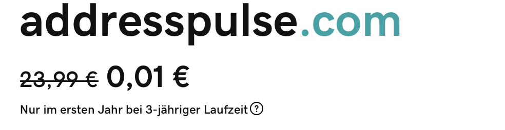

# cardxchange

_The self-updating address book_

A service to exchange address data and keep them updated automagically - in my local contacts.

## Phase 0: Shows me linkedIn changes 

- A web app that shows me the changes in my contact crowd from last month / week / day.
- Easier to build b/o web - but needs local storage (maybe).

## Phase 1: Sync LinkedIn to my local contact

- An iOS App, maybe also macOS
- Enter your linkedIn credentials, then show you every day a list of data that changed within your linkedIn friends
	- Per change select
		- Apply these changes (to my local contacts)
		- Apply all changes automatically (also in the future)
		- Skip these changes
		- Skip all changes of this contact (also in the future)
	- And a check box "Do not inform me about changes of this contact anymore"

## Name & Logo

The name _cardXchange_ feels outdated. The younger generations did not grow up professionally with business cards. wild thoughts with the help of [chatGPT](https://chatgpt.com/share/673e03f5-9c04-8009-b066-3acd70d3d1eb), other services and bio-.brains: 
* Swoop → “Let’s Swoop!”, domain swoop.me
* addresspulse.com (available as of 2024-11-20) ![alt text]
* 

## Todo
- Understand Swift Api to contacts App
- Understand linkedIn API
- Can we write 1 code base for iOS/ipadOS and macOS?

## Phase 2: 

## Phase Final: 